## Bird Call Classification Graduate Research Project
### William Gillespie

This is my graduate research project on Bird Call Classification for Eastern Michigan University.
This project used data from a kaggle competition: 

[Link to Kaggle Bird Classification Competition](https://www.kaggle.com/c/multilabel-bird-species-classification-nips2013/overview)

To get the data, go to the data page and download it.  (You may need to create a Kaggle account).
The data link is here: [Data link](https://www.kaggle.com/c/multilabel-bird-species-classification-nips2013/data)

This project seeks to visualize, perform feature extraction, and perform classification on bird calls.

## Visualization

#### Time series wave form visualization
Bird calls can be visualized as a wave signal as below.  
However, this time series data format is difficult for classification algorithms.
Furthermore, it is difficult to interpret, and does not plainly show frequency information.
Thus, other visualization methods must be used to see more detail.

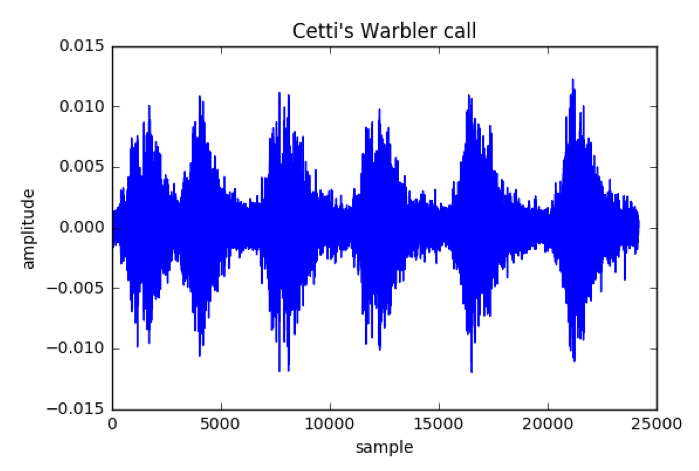

#### Mel Spectrogram Visualization
Mel Spectrograms show information about the intensities of the frequencies.
Here are four examples of different bird calls.  The intense bright spots are where the bird calls are located.

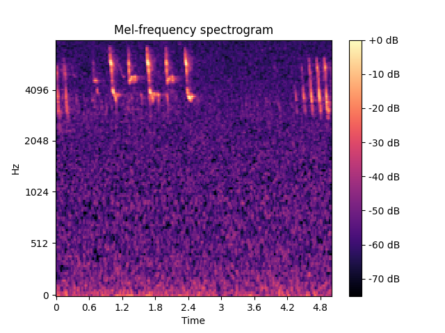
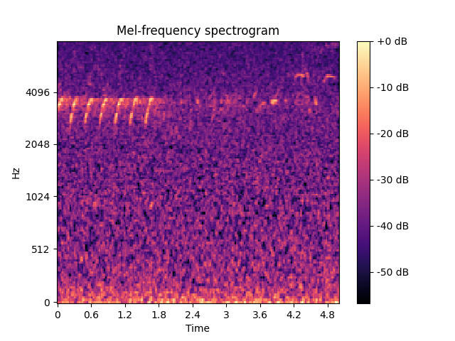
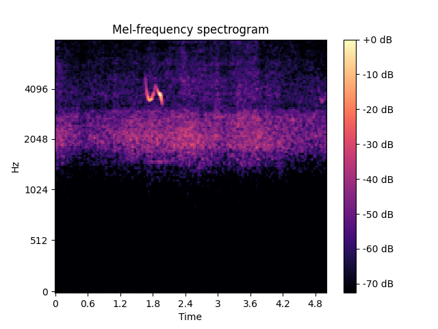
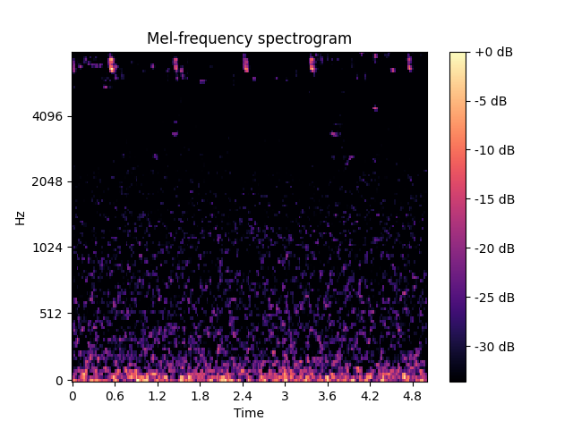

#### Mel Frequency Cepstral Coefficients
Mel Frequency Cepstral Coefficients are key features used for classification in speech recognition.
They have a complicated method of computation.  
However, note that they just represent sums of sound intensity at several frequency bins over a time period.

1) Divide the signal into frames.
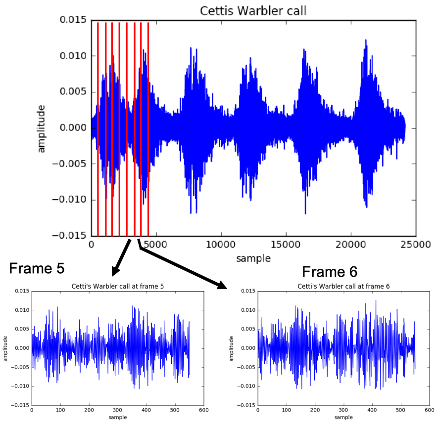

2) Take DFT of the signal in each frame.
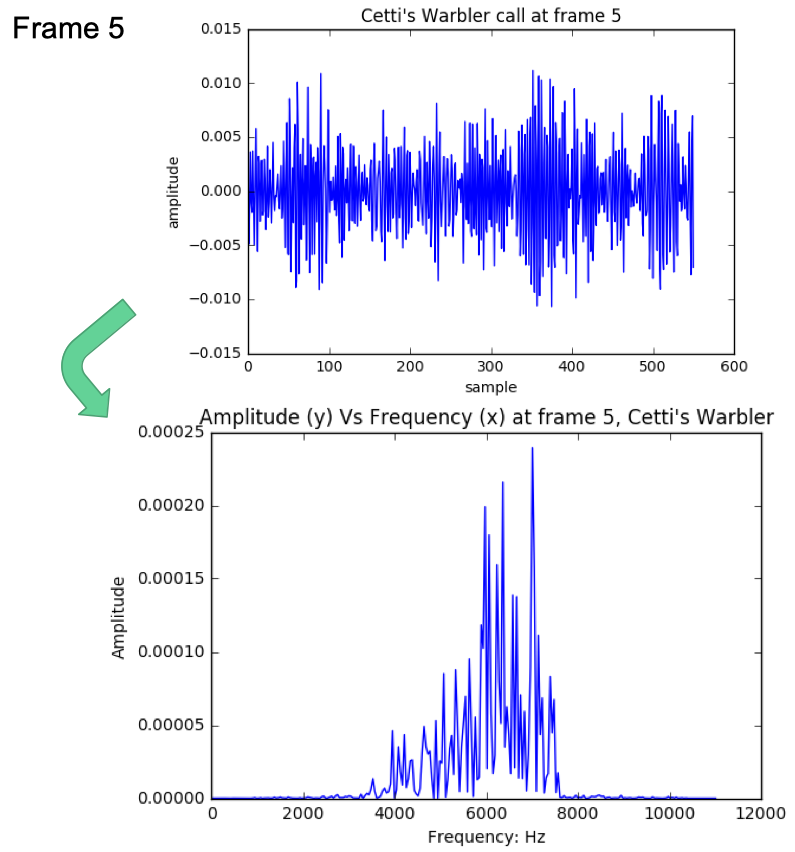

3) Create mel-spaced triangular filter banks along the frequency axis.
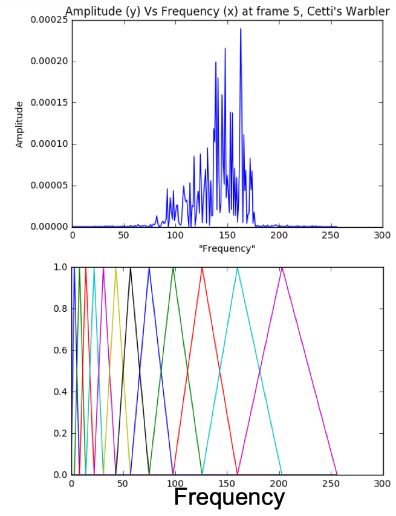

4) Calculate the ‘energy’ at each frequency by taking the dot product of the amplitude signal and a filter bank.
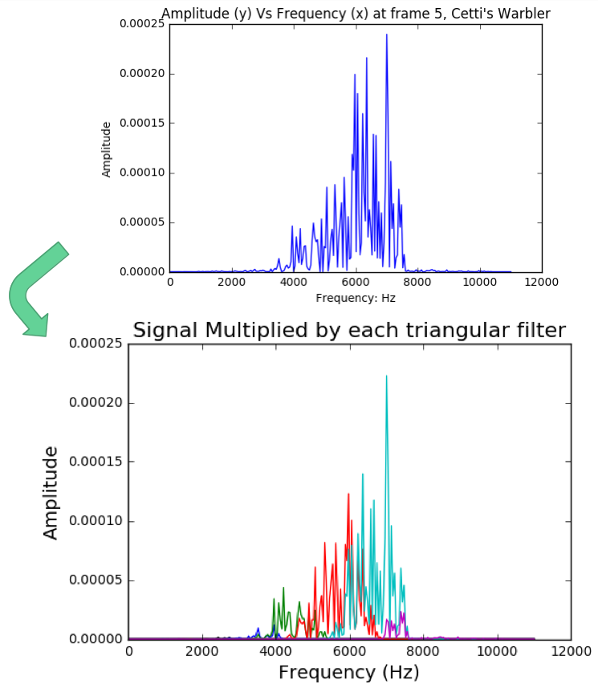

5) Take the log of the filterbank energies

6) Take the Discrete Cosine Transform of the logged energies at each mel-spaced filter bank
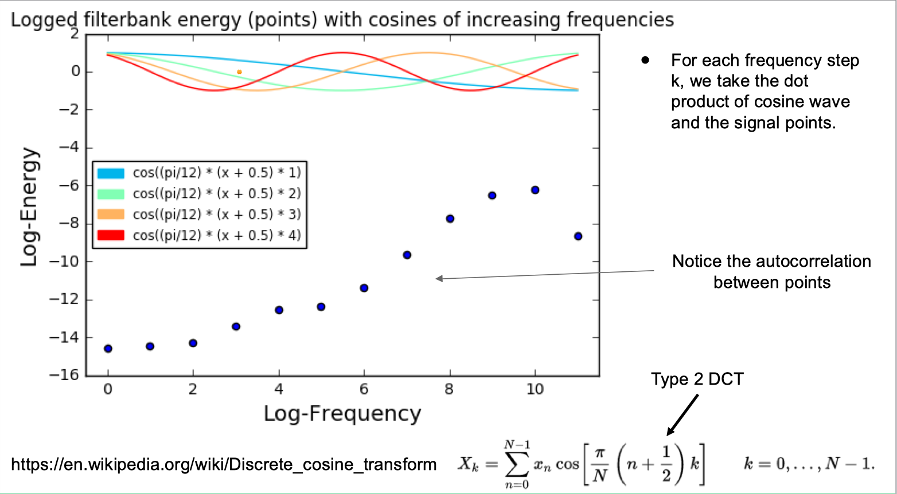

Once the MFCCs have been calculated, 
we can see figures of the mel spectrogram, 
and the corresponding MFCCs.
One can notice a connection between the bird calls and the amplitudes of the MFCC waves.
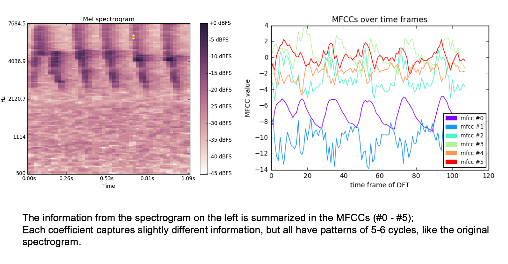

## Classification
In order to classify bird calls using traditional classifiers, 
it is important to perform feature extraction in such a way that we can derive records
that are not time series based.  With the data formatted this way, we can use decision trees and neural networks.
To accomplish this, each wav file is segmented into small chunks, and the MFCCs are calculated from those chunks.
Aggregate statistics are extracted from the MFCCs, 
such as the average, median, mean absolute deviation, and standard deviation of each MFCC.

Kaggle also offers precalculated MFCC data to use for classification from the data folder.
[NIPS4B_BIRD_CHALLENGE_TRAIN_TEST_MFCC](NIPS4B_BIRD_CHALLENGE_TRAIN_TEST_MFCC/)

A neural network classifier and decision tree classifier were used.
They can be found at these locations:
[Neural Network Classifier](classifications/neural_network_classification.py)
[Decision Tree Classifier](classifications/decision_tree_classification.py)

# Conclusion
My results were rated with an AUC value that Kaggle gave uploaders upon submission.
I have results using the following methods:
Using Kaggle's MFCCs with Neural Networks: 77% AUC
Using my own calculated MFCC aggregation statistics with Neural Networks: 71% AUC
Using my own calculated MFCC aggregation statistics with Decision Trees: 62.6% AUC

# Reflection
Overall, this was a fulfilling experience as a way to finish my graduate degree with research and a presentation.
I spent much time visualizing the features, and documenting the feature extraction.
While this has value, much more work could have been done with the classification aspects instead.

Other methods could be used in the future that don't involve eliminating the time series aspect.
Perhaps convolutional neural networks could be used to analyze the waveforms or MFCC waves instead.

William Gillespie